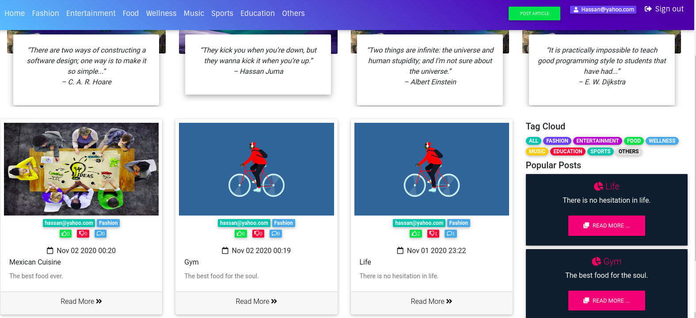

#  BLOG
### 31.10.2020
####  A Python Flask CRUD web application for sharing blogs.

## Description
This is a flask multi-user blog application where a user can sign up,log in post and delete blog articles,comment on articles and also get inspired by random prgramming quotes.

#### Live link : https://hassanblog.herokuapp.com/

## Description

An application which shows pitches from various categories using the python web framework, Flask.

## User Stories

- A user I can view various articles on the homepage of the application.
- A user can select a pitch and see pitch details from the selected pitch in the application.
- A user can search for a article on the homepage.
- A user can see the image, description,author and the time a article was created.
- A can click on an article and read the full pitch on the source website.

## Behaviour Driven Development (BDD)

| Behaviour                                                                                        |                                                                      Input                                                                       |                                                                                                 Output |
| ------------------------------------------------------------------------------------------------ | :----------------------------------------------------------------------------------------------------------------------------------------------: | -----------------------------------------------------------------------------------------------------: |
| Page loads, user arrives in the landing page, a list of all available blog category is displayed. | The user can click on any particular list group item to be directed to a separate page containing pitch highlights pitched by the same publisher. | On clicking the "create an article" button, the user is redirected to the main login and signup to allow you create an article of your choice. |  |

## Features

Here are the summary:

- A landing page showing blog categories.
- Clickable blogs which direct the user to a page with article highlights from the particular blog.

## Requirements

- This program requires python3.+ (and pip) installed, a guide on how to install python on various platforms can be found [here](https://www.python.org/)

##### Contribution

To fix a bug or enhance an existing module, follow these steps:

- Fork the repo
- Create a new branch (`git checkout -b improve-feature`)
- Make the appropriate changes in the files
- Add changes to reflect the changes made
- Commit your changes (`git commit -am 'Improve feature'`)
- Push to the branch (`git push origin improve-feature`)
- Create a Pull Request

### Bug / Feature Request

If you find a bug (the website couldn't handle the query and / or gave undesired results), kindly open an issue [here](https://github.com/HASSAN1A/Blog/issues/new) by including your search query and the expected result.
If you'd like to request a new function, feel free to do so by opening an issue [here](https://github.com/HASSAN1A/Blog). Please include sample queries and their corresponding results.

## Built with

1. [Python 3.8.2](https://www.python.org/doc/) : Programming language.
2. [Flask; Python framework used.](https://flask.palletsprojects.com/en/1.1.x/):Framework used.
3. [HTML](https://www.w3schools.com/html/) : Layout.
4. [CSS](https://www.w3schools.com/css/) : Styling.
5. [Bootstrap](https://mdbootstrap.com/) : For responsive websites.
6. [posgreSQL](https://www.postgresql.org/) : Database language.
7. [psycopg2](https://pypi.org/project/psycopg2/) : Database driver.
8. [Javascript](https://www.w3schools.com/js/DEFAULT.asp) : often abbreviated as JS, is a programming language that conforms to the ECMAScript specification.[7] JavaScript is high-level, often just-in-time compiled, and multi-paradigm. It has curly-bracket syntax, dynamic typing, prototype-based object-orientation, and first-class functions.
9. [Google Font API](https://dillinger.io/fonts.google.com) : For prettier fonts Making the web more beautiful, fast, and open through great typography..
10. [Quotes Api](http://quotes.stormconsultancy.co.uk/random.json) : For requesting
11. [Font Awesome](fontawesome.com) : The world's most popular and easiest to use icon set just got an upgrade. More icons. More styles.
12. [jQuery 3](https://jquery.com/) : For special effects.

## TEAM

[Hassan Juma ](https://github.com/HASSAN1A)

## [License](https://github.com/HASSAN1A/Blog/blob/master/LICENSE.md)

[MIT](https://github.com/HASSAN1A/Blog/blob/master/LICENSE.md) © [Hassan Juma](https://github.com/HASSAN1A)
